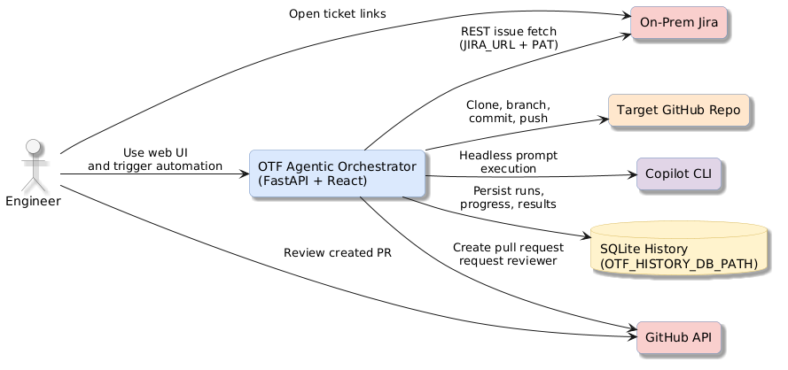
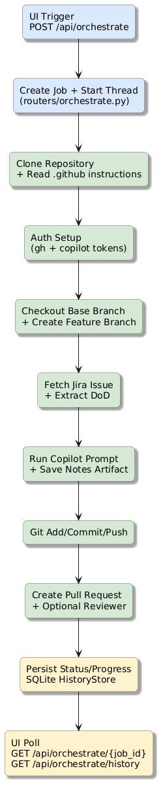
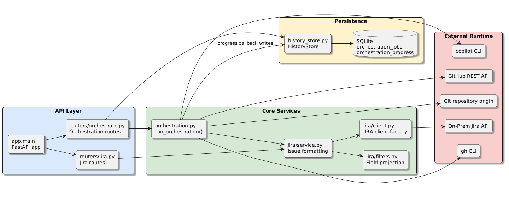
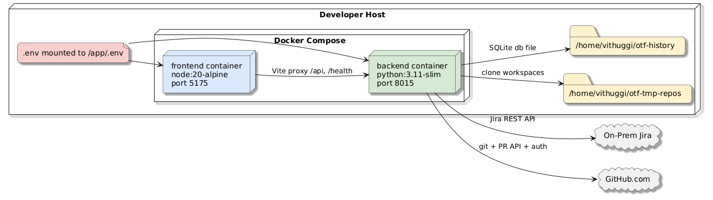

# 1. Executive Summary

AGENT_FLOW Agentic Orchestrator is a two-container application that automates Jira-driven software delivery workflows. It combines a FastAPI backend with a React + Vite frontend to trigger, monitor, and persist end-to-end orchestration runs. A run fetches Jira context, clones a target repository, invokes Copilot CLI for agentic implementation guidance, creates commits/branches, and opens GitHub pull requests. The system persists run history and progress events in SQLite so users can inspect active and completed jobs. It is designed for on-prem Jira compatibility and headless operation using token-based authentication.

# 2. Architecture Overview



The system has one primary runtime boundary: the orchestrator stack (frontend + backend) running under Docker Compose.

- Frontend (Vite dev server) provides trigger and run-history UX.
- Backend (FastAPI) executes orchestration jobs asynchronously and exposes REST endpoints.
- Jira integration is implemented through the Python jira client and filter projection rules.
- GitHub integration uses both git operations and REST API calls for PR creation and reviewer assignment.
- Copilot CLI is used for autonomous, headless prompt execution inside cloned repositories.
- SQLite stores job metadata and progress timelines for observability and post-run analysis.

# 3. Processing Pipeline



## Pipeline Walkthrough

1. UI submits `POST /api/orchestrate` with Jira ticket, target repository, branch, reviewer, commit message, and change plan.
2. Backend allocates a `job_id`, persists a queued job in `HistoryStore`, and starts a background thread.
3. Worker clones the repository to `AGENT_FLOW_REPO_BASE_DIR`, then scans `.github` instructions.
4. Worker validates runtime/auth tooling (`gh`, `copilot`) and resolves Copilot token source.
5. Worker checks out the requested base branch, fast-forwards, and creates feature branch.
6. Worker fetches Jira issue details and extracts DoD bullet points from description text.
7. Worker submits a single rich Copilot prompt with Jira context, implementation plan, and repository instructions.
8. Worker writes an implementation artifact under `.agent_flow_agentic/` and computes change statistics.
9. Worker stages/commits changes (excluding `.agent_flow_agentic/**`), pushes branch, and creates PR via GitHub API.
10. Worker stores final result payload (PR URL, steps, usage metrics), while UI polls status and history.

# 4. Core Components



## Backend Components

| Component | Responsibility | Key Entry Points |
|---|---|---|
| `app.main` | FastAPI bootstrapping, `.env` loading, CORS setup, router registration | `app`, `_load_environment()` |
| `app.routers.orchestrate` | Job API, background thread lifecycle, status/history endpoints | `orchestrate()`, `orchestrate_status()`, `orchestrate_history()` |
| `app.orchestration` | Full agentic workflow execution and external integration | `run_orchestration()` |
| `app.history_store` | SQLite schema, job/progress persistence, retention cleanup | `HistoryStore`, `get_history_store()` |
| `app.routers.jira` | Jira endpoint wrappers and HTTP error mapping | `list_issues()`, `get_issue()` |
| `app.jira.service` | Jira retrieval + response shaping with filter config | `get_issues()`, `get_issue()` |
| `app.jira.client` | Jira client factory and auth/config validation | `get_client()` |
| `app.jira.filters` | YAML field filter loading and projection logic | `load_filters()`, `apply_filter()` |

## Frontend Components

| Component | Responsibility | Key Behaviors |
|---|---|---|
| `src/App.jsx` | Main orchestration console, run trigger, polling, history rendering | Trigger form, result panels, artifact modal |
| `src/FlowDiagram.jsx` | Stage visualization for runtime progress | Step-state resolution, status legends, custom icons |
| `vite.config.js` | Dev server proxy to backend service | `/api`, `/health` forwarding |

## Cross-Cutting Behaviors

- Error handling: orchestration failures are captured and returned with per-job status.
- Progress telemetry: `progress_callback` emits named step events persisted in SQLite.
- Security boundary: tokens are sourced from environment variables and not persisted in history payloads.

# 5. API Contracts / Message Schemas

## Health

- Method: `GET /health`
- Response:

| Field | Type | Description |
|---|---|---|
| `status` | string | Always `ok` when service is available |

## Jira Issues

- Method: `GET /api/jira/issues?jql=<optional>&max_results=<1..100>`
- Response:

| Field | Type | Description |
|---|---|---|
| `issues` | array<object> | Filtered Jira issues based on `backend/config/filters.yaml` |

Each issue includes:

| Field | Type | Notes |
|---|---|---|
| `key` | string | Jira issue key (for example `AGENT_FLOW-123`) |
| `url` | string | Direct Jira browse URL |
| `summary` | string | If available via filter projection |
| `description` | string | If included by filter projection |
| `status` | string | Derived from `status.name` mapping |

## Trigger Orchestration

- Method: `POST /api/orchestrate`
- Request body:

| Field | Type | Required | Description |
|---|---|---|---|
| `jira_ticket_id` | string | Yes | Jira issue key |
| `repository` | string | Yes | `owner/repo` or clone URL |
| `base_branch` | string | Yes | Base branch to branch from |
| `reviewer` | string/null | No | GitHub reviewer username |
| `commit_message` | string | Yes | Commit message for automated commit |
| `change_plan` | array<string> | No | Planner bullets passed to Copilot prompt |

- Response body:

| Field | Type | Description |
|---|---|---|
| `job_id` | string | Job identifier (UUID) |
| `status` | string | Initial status (`queued`) |

## Poll Orchestration Status

- Method: `GET /api/orchestrate/{job_id}`
- Response body:

| Field | Type | Description |
|---|---|---|
| `id` | string | Job identifier |
| `status` | string | `queued` | `running` | `success` | `failed` |
| `request` | object | Original request payload (plus `jira_url`) |
| `result` | object/null | Final result after completion |
| `progress` | array<object> | Ordered progress events |
| `error` | string/null | Failure reason if status is `failed` |

### Progress Event Schema

| Field | Type | Description |
|---|---|---|
| `timestamp` | string | ISO-8601 UTC timestamp |
| `name` | string | Stage identifier (`clone_repository`, `create_pr`, etc.) |
| `status` | string | Stage state (`running`, `success`, `failed`, `skipped`) |
| `details` | string/null | Optional contextual detail |

# 6. Infrastructure & Deployment



## Container Topology

- `backend` service:
  - Base image: `python:3.11-slim`
  - Exposed port: `8015`
  - Installs `git`, `gh`, `nodejs`, `npm`, and global `@github/copilot`
- `frontend` service:
  - Base image: `node:20-alpine`
  - Exposed port: `5175`
  - Runs Vite dev server

## Compose Runtime Configuration

- Root `.env` is mounted into both containers at `/app/.env`.
- Backend persistent mounts:
  - `/home/vithuggi/agent_flow-tmp-repos` -> `/tmp/agent_flow-tmp-repos` (repo clones)
  - `/home/vithuggi/agent_flow-history` -> `/tmp/agent_flow-history` (SQLite db)
- Frontend proxy target is configured using `VITE_PROXY_TARGET=http://backend:8015`.

## CI/CD and Automation

No CI workflow files were detected under `.github/workflows/` in the current repository snapshot. Build and runtime automation currently relies on local Docker Compose and manual command execution.

# 7. Extension Patterns

## Add a New Orchestration Stage

1. Add stage emission in `app/orchestration.py` using `_emit_progress(...)`.
2. Append `StepResult(...)` entries for final result reporting.
3. Ensure failures raise `OrchestrationError` for coherent status propagation.
4. Add frontend display mapping in `src/App.jsx` and `src/FlowDiagram.jsx` if it should appear visually.
5. Add/adjust tests in `backend/tests/test_orchestration.py` and router tests for payload changes.

## Add Jira Field Projections

1. Update `backend/config/filters.yaml` with additional dotted field paths.
2. Optionally map renamed output keys using `rename`.
3. Validate output through `GET /api/jira/issues`.
4. If project-specific, add under `projects.<KEY>` section.

## Add Additional Result Artifacts

1. Generate artifact files during run in `run_orchestration()`.
2. Include metadata in returned `artifacts` list (`path`, `content`).
3. Frontend history panel auto-renders artifact buttons and markdown modal content.

# 8. Rules & Anti-Patterns

## Operational Rules

- Do not run orchestration without `GITHUB_TOKEN`; backend fails fast if missing.
- Prefer dedicated `COPILOT_GITHUB_TOKEN` with Copilot Requests permission for headless runs.
- Keep `.agent_flow_agentic/**` out of commits (`_COMMIT_EXCLUDE_PATHS`) to avoid committing generated notes.
- Use normalized repo inputs (`owner/repo` or full GitHub clone URL only).

## Anti-Patterns

- Hardcoding Jira credentials in source files.
- Expanding filters to include large, unnecessary Jira payloads for list views.
- Treating progress events as unordered; UI and history semantics rely on sequence.
- Running against non-fast-forward base branches without reconciling upstream state.

# 9. Dependencies

## Backend (Python)

| Package | Version Spec | Purpose |
|---|---|---|
| fastapi | >=0.110 | API framework |
| uvicorn[standard] | >=0.29 | ASGI server |
| python-dotenv | >=1.0 | Environment loading |
| jira | >=3.8 | Jira API client |
| pyyaml | >=6.0 | Filter config parsing |
| requests | >=2.31 | GitHub REST API calls |
| pytest | >=8.2 | Test framework |
| httpx | >=0.27 | HTTP testing/runtime support |

## Frontend (Node)

| Package | Version Spec | Purpose |
|---|---|---|
| react | ^19.2.0 | UI runtime |
| react-dom | ^19.2.0 | DOM renderer |
| react-markdown | ^10.1.0 | Markdown artifact rendering |
| remark-gfm | ^4.0.1 | GFM support in markdown |
| vite | ^7.2.0 | Dev/build tooling |
| @vitejs/plugin-react | ^5.1.0 | React transform plugin |

# 10. Code Structure

```text
agentic-orchestrator/
├── backend/
│   ├── app/
│   │   ├── jira/
│   │   │   ├── client.py
│   │   │   ├── filters.py
│   │   │   └── service.py
│   │   ├── routers/
│   │   │   ├── jira.py
│   │   │   └── orchestrate.py
│   │   ├── history_store.py
│   │   ├── main.py
│   │   └── orchestration.py
│   ├── config/
│   │   └── filters.yaml
│   ├── tests/
│   │   ├── conftest.py
│   │   ├── test_history_store.py
│   │   ├── test_orchestrate_router.py
│   │   └── test_orchestration.py
│   ├── Dockerfile
│   └── requirements.txt
├── frontend/
│   ├── src/
│   │   ├── App.jsx
│   │   ├── FlowDiagram.jsx
│   │   ├── main.jsx
│   │   └── styles.css
│   ├── Dockerfile
│   ├── index.html
│   ├── package.json
│   └── vite.config.js
├── docker-compose.yml
└── README.md
```

## Accuracy Spot-Checks

The following implementation artifacts were directly reviewed while generating this document:

- `backend/app/main.py`
- `backend/app/orchestration.py`
- `backend/app/history_store.py`
- `backend/app/routers/orchestrate.py`
- `backend/app/jira/service.py`
- `frontend/src/App.jsx`
- `frontend/src/FlowDiagram.jsx`
- `docker-compose.yml`
